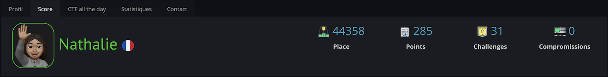

# 
  Hi 👋🏽 

# 
👩🏽‍💻MacOS user 👩🏽‍💻

# 📍À propos de moi📍

Je suis actuellement en première année d'école d'informatique et je suis passionné par la sécurité informatique et les infrastructures réseau. Je suis intéressée par la façon dont les systèmes informatiques sont conçus, protégés et exploités, ainsi que par les menaces auxquelles ils sont confrontés.

J'ai une bonne compréhension des langages de développement web tels que JS, CSS et HTML, ainsi que du langage GO. J'aime travailler sur des projets pour améliorer mes compétences et en apprendre davantage sur les dernières technologies et les meilleures pratiques.

# 🛠️ Mes compétences 🛠️

- Conception et développement de sites web
- Pratique des méthodologies de développement
- Utilisation de machine virtuelle Linux, Windows, MacOS 
- Aprentissage d'hashcat, burp suit, OSINT
- Création et configuration d'un routeur pfsense via VM
- Apprentissage Java et JavaFX

# 🧨 Mes projets 🧨

- Hangman / Hangman Web :  https://07profil-office.wixsite.com/nathalie-albert/projets
- Groupie Tracker :  https://07profil-office.wixsite.com/nathalie-albert/projets
- CHAT en JavaScrit :  https://07profil-office.wixsite.com/nathalie-albert/projets (en cours)
- Challenge 48h (Site de prevention contre le phishing) :  https://07profil-office.wixsite.com/nathalie-albert/projets
- Boxxle Game :  https://07profil-office.wixsite.com/nathalie-albert/projets
- Super Simon :   https://07profil-office.wixsite.com/nathalie-albert/projets
- Tamagoshi : Création d'un tamagoshi sur AndroidStudio en Java et en JavaFX

# 🖇️ Mes objectifs 🖇️

- Améliorer mes compétences en matière de sécurité informatique et d'infrastructures réseau.
- Travailler sur des projets concrets pour acquérir une expérience pratique. 
- Travailler dans une entreprise où je pourrai contribuer à la conception, à la mise en place et à la maintenance de systèmes informatiques sécurisés et fiables.

# 👩🏽‍💻Langages 👩🏽‍💻

 

# 💻 Workstation 💻
 

# OS Utilisés via Machines virtuelles

# Maquettes	
 
 

# Mes statistiques GitHub

 

# Root Me

 

# 📞 Contact 📞

LinkedIn : nathalie-albert-89a266253  
GitHub : NathyAbr 
GitTea : anathali
